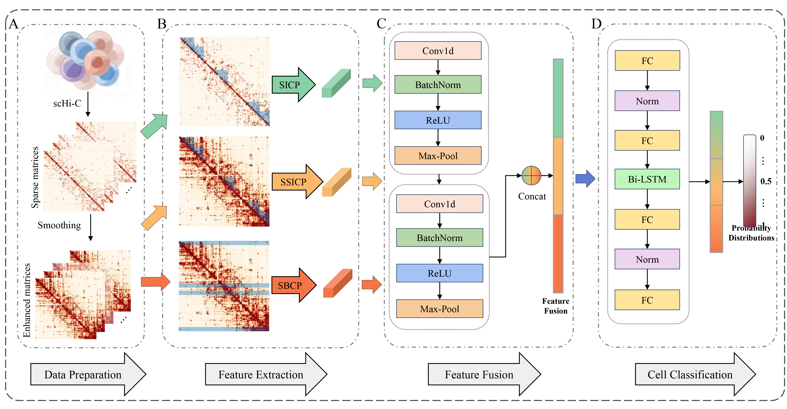

# CTPredictor

A comprehensive and robust framework for predicting cell types by integrating multi-omic features from single-cell Hi-C data 

## Framework

(A) Data preparation. The input scHi-C dataset undergoes transformation into matrices. Our model generates sparse chromosome contact matrices for each cell from interaction pairs files in scHi-C data and simultaneously produces enhanced matrices through spatial smoothing. (B) Feature extraction. In this study, we extract small intra-domain contact probability (SICP) from the sparse matrices, smoothed small intra-domain contact probability (SSICP), and smoothed bin contact probability (SBCP) from the enhanced matrices. (C) Feature fusion. To amalgamate feature information from diverse perspectives, we introduce a fusion module. This module employs two convolutional blocks to extract more intricate and crucial features. (D) Cell classification. The fusion features are then employed to accurately predict cell types.

## Overview

The folder "4DN" contains of the preocessing of 4DN sci-HiC dataset.  
The folder "Flyamer" contains of the preocessing of Flyamer et al. dataset.  
The folder "Ramani" contains of the preocessing of Ramani et al. dataset.  
The folder "Lee" contains of the preocessing of Lee et al. dataset.  
The folder "Collombet" contains of the preocessing of Collombet et al. dataset.  
The folder "Nagano" contains of the preocessing of Nagano et al. dataset.  
The folder "Data_filter" contains processed data from six datasets.  

In the above six folders, each folder contains folder "generate_features" and folder "model":  
The folder "generate_features" caontains of the peocess of extracting multi-omic features.  
The folder "model" contains the framework of models.

The file "index_promoters.txt" and "word2vec_promoters.txt" are benchmark files used to extract word2vec features of human.  
The file "RF.py" is the code of the random forest model.  
The file "CNN.py" is the code of the CNN model.  
The file "Weighted_average.py" is the code of the weighted average algorithm.  
The file "main.py" is the code of the entire model and will import RF, CNN and Weighted_average.  
The file "feature_code.py" is the code used to extract word2vec features.  
The file "feature_importance.rar" is a compressed file for exploring important motifs, including code and specific results.  
The file "R.capsulatus.rar" is an example feature file to verify model performance (the feature file for the human dataset is too large to upload to github).  

## Dependency
Mainly used libraries:  
Python 3.6    
pytorch
xlsxwriter
sklearn  
numpy  

## Usage
First, you should extract features of data, you can run the script to extract smoothed bin contact probabilit (SBCP), small intra-domain contact probability (SICP), and smoothed small intra-domain contact probability (SSICP) features as follows:  
`python ./generate_features/generate_feature_sicp.py`  
`python ./generate_features/generate_feature_ssicp.py`  
`python ./generate_features/generate_feature_sbcp.py`    
Then run the script as follows to compile and run iPro-WAEL:  
`python main.py`  
Note that the variable 'cell_lines' needs to be manually modified to change the predicted cell line.  
